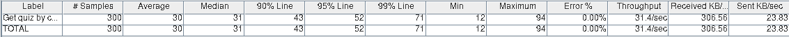

# Software Architecture Project Report

## Performance during the process of answering a quiz

### Architecture

**TODO**: Try making process more data driven and split quizAnswerItem

### Scenarios

To answer an available quizz, 1000 student users start the quiz, submit answers to the questions and conclude the quiz. The quizzes tutor saves each answer and the conclusion with a maximum latency of 200ms, with a throughput of 1000/sec, with 0% of miss rate.

### Tests

[Get quiz with code](backend/jmeter/answer/get-quizzes.jmx)

* The teacher logs in, creates the questions and makes the quiz
* 1000 students log in
* After everyone logs in, the teacher populates the quiz
* Then each student enters the code to get the quiz

#### Results:

This first test tried to simulate a real scenario where multiple students insert the code for the quiz at a random time between 1s and 10s. (Bigger intervals where tested and they gave similar results)

* 300 students

* 600 students

* 1000 students

With this tests we can conclude that at least until 1000 students, the average time taken to get the quiz is independent of the number of students.

This second test tried to simulate a limit scenario where all the students insert the code at the same time (This test uses a synchronizing timer to make sure that all threads are created before the get quiz sample starts)

* 300 students

* 600 students

* 1000 students

This time we can see that the average time it takes to get a quiz is proportional to the number of students. 

[Quiz answering with code](backend/jmeter/answer/quiz-answer-with-code.jmx)

* Logs in as teacher, creates a quiz and populates it
* 1000 students log in and get the quiz by code
* After everyone gets the quiz, they start at the same time and answer the questions
* These questions are answered in a time according to a normal distribution, with average of 35 seconds and deviation of 5 seconds
* After the students have answered all the questions, the teacher writes the answers

This tests yielded a average sample time of 12 ms.

If the test does not use the functionality of populating the quiz answers before the students answer, (using 600 students) the average sample time increases to 13 seconds.