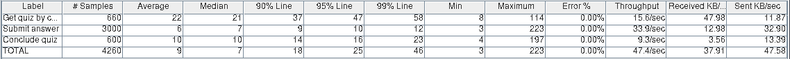

# Software Architecture Project Report

In this report we analyse and address the qualities associated with the functionalities of answering a quiz in the Quizzes Tutor system.

## Table of Contents
1. [Performance](#1-performance)
    1. [Scenarios](#11-scenarios)
    2. [Architecture](#12-architecture)
    3. [Tests](#13-tests)
        1. [Get quiz with code](#131)
        2. [Quiz answering with code](#132)
2. [Scalability](#2-scalability)
    1. [Scenarios](#21-scenarios)
    2. [Architecture](#22-architecture)
    3. [Tests](#23-tests)
        1. [Real scenario test](#231)
        2. [All students at the same time](#232)
3. [Availability](#3-availability)
    1. [Scenarios](#31-scenarios)
    2. [Architecture](#32-architecture)
    3. [Tests](#33-tests)
        1. [Real scenario test](#331)
        2. [All students at the same time](#332)
4. [Security](#4-security)
    1. [Scenarios](#41-scenarios)
    2. [Architecture](#42-architecture)
    3. [Tests](#43-tests)
        1. [Scenario Tests](#431)
        2. [Real scenario test](#432)
        3. [All students at the same time](#433)

## 1. Performance

### 1.1 Scenarios

**1)** After the login and within a period of 10s, 600 student users make a request stochastically by inserting a code to get access to the quiz. The Quizzes Tutor, in normal operation, sends the quiz's questions to each user in less than 30 milliseconds.

**2)** After accessing the quiz, 600 students wait until the end of the timer to start the quiz. All the students answer to the questions following a normal distribution and in the end conclude the quiz. The Quizzes Tutor receives the answers and the final submissions and saves, for each student, this information in a database in less than 15 milliseconds.

### 1.2 Architecture

This architecture represents the current architecture of Quizzes Tutor, since as we will see below in the test results, there was no need to make any changes to comply with the established scenarios. 
  
### 1.3 Tests

####  1.3.1 Get quiz with code

* The teacher logs in, creates the questions and makes the quiz
* 1000 students log in
* After everyone logs in, the teacher populates the quiz
* Then each student enters the code to get the quiz

**Results:**

This [first test](backend/jmeter/answer/get-quizzes-rt.jmx) tried to simulate a real scenario where multiple students insert the code for the quiz at a random time between 1s and 10s. (Bigger intervals where tested and they gave similar results)

* 300 students

* 600 students

* 1000 students

**Conclusions:** With these tests we can conclude that at least until 1000 students, the average time taken to get the quiz is independent of the number of students.

This [second test](backend/jmeter/answer/get-quizzes-st.jmx) tried to simulate a limit scenario where all the students insert the code at the same time (This test uses a synchronizing timer to make sure that all threads are created before the get quiz sample starts)

* 300 students

* 600 students

* 1000 students

**Conclusions:** This time we can see that the average time it takes to get a quiz is proportional to the number of students. We did not address this slight performance issue, since in a real scenario the students enter the quiz code with a couple of minutes in advance, if it were any faster than it is now, it would not make any difference because they would not notice that. As we can see above, even if all the students enter at the same time, for 1000 it would take in average 2.4s to get a quiz, but since they enter at least one minute or more before the start of the quiz, it is not an issue. 

####  1.3.2 Quiz answering with code

* The teacher logs in, creates the questions and makes the quiz
* 1000 students log in
* After everyone logs in, the teacher populates the quiz
* Then each student enters the code to get the quiz
* After everyone gets the quiz, they start at the same time answering the questions
* These questions are answered in a time according to a normal distribution, with average of 35 seconds and deviation of 5 seconds
* After the students have answered all the questions, the teacher writes the answers

**Results:**

This [test](backend/jmeter/answer/quiz-answer-with-code-rt.jmx) corresponds to the scenario 2.

* 300 students

* 600 students

* 1000 students

**Conclusions:** With this test we can see that the process of answering a quiz is independent of the number of students (at least until 1000 students) and it's faster than getting a quiz.

In this [test](backend/jmeter/answer/quiz-answer-with-code-st.jmx), we tried to simulate an unrealistic scenario where all the students get the quiz and answer the questions at the same time, without having time to "think". We pretended to stress test the system to see how it would cope.

* 300 students

* 600 students

* 1000 students

**Conclusions:** In this second test, we can see that the average times in the process of answering a quiz are proportional to the number of students but not as much as in the get quiz test. This time, even with 1000 students answering at the same time, the average is below 1s. So with all these tests, we can conclude that the system that already exists achieves the performance desired to fulfill the requirement of having 1000 students answering a quiz using a code, previously populated with answers.

In the chart above we can observe that the performance almost follows a linear distribution, even for a high number of simultaneous users.

## 2. Scalability

Analyzing the test for performance, we detected a bottleneck in the access to the database while submitting an answer and concluding the quiz. Initially we tried a monolithic approach, where each thread had a table to store the answers, but this approach only scaled vertically, and if it were horizontally scaled would make increasing the performance easier, the solution was microservices, since we only needed to boot more instances of a microservice and add more hardware to easily increase performance without much effort. Therefore, we made the following changes:
* Created a microservice to handle the submission of answers, with its own database to store the submissions.
* Created a microservice to handle the submission quizzes' submissions, with its own database to store the submissions.

The backend now in order to get information about the answers has to communicate with the microservice that has that information to get it, has we can see in the architecture developed below.

### 2.1 Scenarios
With an increment of 1000 students answering a quiz, the Quizzes Tutor preserves almost the same performance with the cost of using more servers, consequently more hardware and money.

### 2.2 Architecture

As showed above we can use the **Multiple Copies of Computation** tactic with microservices to address the performance issue when we have a lot of simultaneous users, the results obtained, as we will see, surpassed our expectations, since with only one instance of each microservice the performance was increased by 15% with 2500 students.

### 2.3 Tests

To test scalability we used the **Quiz answering with code** test from performance, just adapting it to call the correct microservices.
In this tests we just use one instance of each microservice.

####  2.3.1 [Real scenario test](backend/jmeter/answer/quiz-answer-with-code-scalability-rt.jmx)

This first test is the one that tried to simulate a real scenario where multiple students insert the code for the quiz at a random time between 1s and 10s. 

* 300 students

* 600 students

* 1000 students

* 2000 students

**Conclusions:** We can see that with the microservices architecture even for a normal scenario response times are faster.

####  2.3.2 [All students at the same time](backend/jmeter/answer/quiz-answer-with-code-scalability-st.jmx)

The second test was the one that tried to simulate an unrealistic scenario where all the students get the quiz and answer the questions at the same time.

* 300 students

* 600 students

* 1000 students

* 2000 students

**Conclusions:** In this second test, we can conclude that the average times for submitting an answer didn't change and the times for concluding a quiz increased a bit, but overall the average total time decreased specially for a high number of simultaneous users. Looking at the architecture view above we find that since each request is processed independently, we have the guarantee that it scales with the hardware, so deploying more instances of the microservices would decrease the average times. 

From the chart we can conclude that even with only one instance of each microservice, the performance was improved and with more instances and hardware it can be further improved.

## 3. Availability

### 3.1 Scenarios
A student initiates a quiz and answers to any number of questions (excluding the last one) and closes the browser.  The Quizzes Tutor preserves the answers and the student can still answer the rest of the quiz if it is on time. When the student returns to the quiz, the Quizzes Tutor gets the quiz with the answers already done with 200 milliseconds.

### 3.2 Architecture

To address this situation each time a user goes to the next question, we save it in the *Submit Answer* microservice as a "*final answer*", in other words, as the final answer of the student to a given question, so if he exits the quiz because he misclicked or his browser crashed, if he tries to reenter the quiz, from his final answers we can reconstruct where he left on the quiz, leaving him exactly where he left. To achieve this the **Rollback** tactic was used.
  
### 3.3 Tests
In these tests we adapted the previous ones, such that 10% of the students get the quiz by qr code, answer to 2 questions and then "exit the quiz", after that they get the quiz by qr code again, and finally they answer to the last 3 questions.

####  3.3.1 [Real scenario test](backend/jmeter/answer/quiz-answer-with-code-availability-rt.jmx)
* 300 students

* 600 students

* 1000 students

####  3.3.2 [All students at the same time](backend/jmeter/answer/quiz-answer-with-code-availability-st.jmx)
* 300 students

* 600 students

* 1000 students

**Conclusions:** In this second test, we think that the average times of the concludeQuiz are smaller than in the previous quality because since 10% of the students have to get the quiz again, they will finish later so there are less students concluding the quiz at the same time. Besides that, the results stay similar to the ones we obtained in scalability, so the changes we have made to improve availability didn't have an impact on performance.

## 4. Security

### 4.1 Scenarios

Assuming the system is fully operational in all the scenarios below:

**1)** A student attempts to submit two times the answers to the same quiz. He submits a quiz once and he tries to submit again via other means, like Postman, since in the frontend we can only submit once. The second submission is rejected because he submitted already once.

**2)** A student attempts to know the quiz before answering it. He gets the questions from another student or by other means and tries to submit the answers with a different order, the submission is rejected.

**3)** A student attempts to get the quizzes question through monitoring the HTTP requests in the network, he finds the correct request, but he cannot read it, because that data is encrypted.

**4)** A student attempts to re-answer a question. The student submitted a question by clicking the arrow next in the user interface, but he realized that he made a mistake and tries to submit it through an HTTP request. It fails, because Quizzes Tutor knows that he already submitted that question as his final answers.

### 4.2 Architecture

We did the following to achieve the scenarios above:

**1)** To solve this scenario we added a column in the table used to save each quiz submission (*quiz_answer_item*) to save the username of the student, then if someone tries to submit a quiz, we verify if there is already a submission for that quiz ID and for that user, if there is, it is declined. To do this the **limit access** tactic was used.

**2)** For this, when the quiz starts, the frontend sends to the *Conclude Quiz* microservice the quiz with the order of the questions, so when we try to conclude a quiz, the order of the questions is checked before accepting the submission. To comply with the scenario, the **Limit Access** tactic was used.

**3)** This was a major vulnerability, where anyone could see all the questions in the quiz, merely by monitoring the requests in the browser, to fix this issue we encrypt the data in the backend and send it to the frontend, where it decrypts it. To achieve this the **Encrypt Data** tactic was used.

**4)** We used a similar approach to the second scenario, where we check if the user already submitted a final answer to a given question, if so, it is rejected. To do this the **Limit Access** tactic was used.
  
### 4.3 Tests

####  4.3.1 Scenario Tests

Some tests fail to show the response from the server to the invalid request.

**[Scenario 1 test](backend/jmeter/answer/quiz-answer-with-code-security-scenario-1.jmx)**

In this test, the student tries to conclude a quiz that he previously had already concluded.

**[Scenario 2 test](backend/jmeter/answer/quiz-answer-with-code-security-scenario-2.jmx)**

Here the student sends the answers of the questions in the concludeQuiz request in an order that is different from the one he received the questions in the getQuizByQrCode request.

**Scenario 3 test:**

**[Scenario 4 test](backend/jmeter/answer/quiz-answer-with-code-security-scenario-4.jmx)**

For this scenario, the student tries to submit an answer for a question that he previously had already submitted and confirmed that it was is final answer.

Then we used the same tests from Performance and Scalability to check how much our changes impacted the performance of the system.

####  4.3.2 [Real scenario test](backend/jmeter/answer/quiz-answer-with-code-security-rt.jmx)
* 300 students

* 600 students

* 1000 students

####  4.3.3 [All students at the same time](backend/jmeter/answer/quiz-answer-with-code-security-st.jmx)
* 300 students

* 600 students

* 1000 students

**Conclusions:** With this tests we can conclude that our changes to improve security only had impact on the submitAnswer request average time that has doubled it's time in the regular scenario but stayed the same for the stress test scenario.
