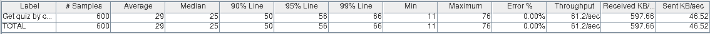
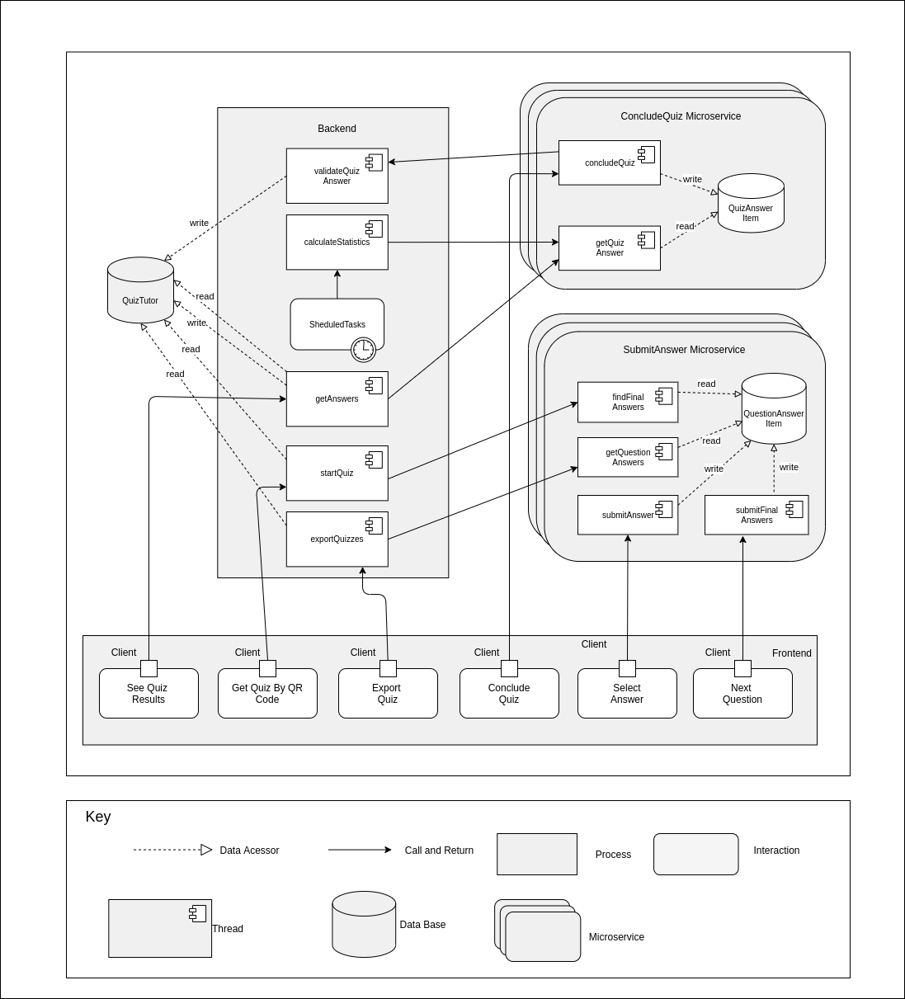
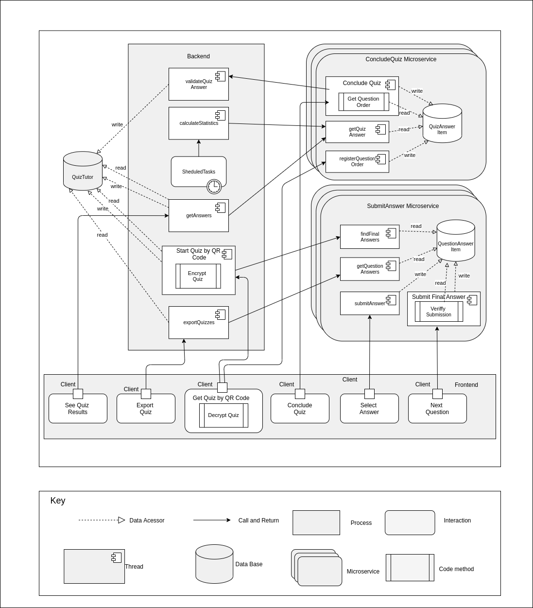

# Software Architecture Project Report

In this report we analyse and address the qualities associated with the functionalities of answering a quiz in the Quizzes Tutor system.

## Table of Contents
1. [Performance](#1-performance)
    1. [Architecture](#11-architecture)
    2. [Scenarios](#12-scenarios)
    3. [Tests](#13-tests)
        1. [Get quiz with code](#131)
        2. [Quiz answering with code](#132)
2. [Scalability](#2-scalability)
    1. [Architecture](#21-architecture)
    2. [Scenarios](#22-scenarios)
    3. [Tests](#23-tests)
3. [Availability](#3-availability)
    1. [Architecture](#31-architecture)
    2. [Scenarios](#32-scenarios)
    3. [Tests](#33-tests)
4. [Security](#4-security)
    1. [Architecture](#41-architecture)
    2. [Scenarios](#42-scenarios)
    3. [Tests](#43-tests)

## 1. Performance

### 1.1 Architecture

This architecture represents the current architecture of Quizzes Tutor, since as we will see bellow in the test results, there was no need to make in changes to comply with the established scenarios. 

### 1.2 Scenarios

**1)** After the login and within a period of 10s, 600 student users make a request stochastically by inserting a code to get access to the quiz. The Quizzes Tutor, in normal operation, sends the quiz's questions to each user in less than 30 milliseconds.

**2)** After accessing the quiz, 600 students wait until the end of the timer to start the quiz. All the students answer to the questions following a normal distribution and in the end conclude the quiz. The Quizzes Tutor receives the answers and the final submissions and saves, for each student, this information in a database in less than 15 milliseconds.
  

### 1.3 Tests

####  1.3.1 [Get quiz with code](backend/jmeter/answer/get-quizzes.jmx)

* The teacher logs in, creates the questions and makes the quiz
* 1000 students log in
* After everyone logs in, the teacher populates the quiz
* Then each student enters the code to get the quiz

**Results:**

This first test tried to simulate a real scenario where multiple students insert the code for the quiz at a random time between 1s and 10s. (Bigger intervals where tested and they gave similar results)

* 300 students

* 600 students

* 1000 students

**Conclusions:** With these tests we can conclude that at least until 1000 students, the average time taken to get the quiz is independent of the number of students.

This second test tried to simulate a limit scenario where all the students insert the code at the same time (This test uses a synchronizing timer to make sure that all threads are created before the get quiz sample starts)

* 300 students

* 600 students

* 1000 students

**Conclusions:** This time we can see that the average time it takes to get a quiz is proportional to the number of students. We did not address this slight performance issue, since in a real scenario the students enter the quiz code with a couple of minutes in advance, if it were any faster than it is now, it would not make any difference because they would not notice that. As we can see above, even if all the students enter at the same time, for 1000 it would take in average 2.4s to get a quiz, but since they enter at least one minute or more before the start of the quiz, it is not an issue. 

####  1.3.2 [Quiz answering with code](backend/jmeter/answer/quiz-answer-with-code.jmx)

* The teacher logs in, creates the questions and makes the quiz
* 1000 students log in
* After everyone logs in, the teacher populates the quiz
* Then each student enters the code to get the quiz
* After everyone gets the quiz, they start at the same time answering the questions
* These questions are answered in a time according to a normal distribution, with average of 35 seconds and deviation of 5 seconds
* After the students have answered all the questions, the teacher writes the answers

**Results:**

This test corresponds to the scenario 2.

* 300 students

* 600 students

* 1000 students

**Conclusions:** With this test we can see that the process of answering a quiz is independent of the number of students (at least until 1000 students) and it's faster than getting a quiz.

In this test, we tried to simulate an unrealistic scenario where all the students get the quiz and answer the questions at the same time, without having time to "think". We pretended to stress test the system to see how it would cope.

* 300 students

* 600 students

* 1000 students

**Conclusions:** In this second test, we can see that the average times in the process of answering a quiz are proportional to the number of students but not as much as in the get quiz test. This time, even with 1000 students answering at the same time, the average is below 1s. So with all these tests, we can conclude that the system that already exists achieves the performance desired to fulfill the requirement of having 1000 students answering a quiz using a code, previously populated with answers.

In the chart above we can observe that the performance almost follows a linear distribution, even for a high number of simultaneous users.

## 2. Scalability

Analyzing the test for performance, we detected a bottleneck in the access to the database while submitting an answer and concluding the quiz. Initially we tried a monolithic approach, where each thread had a table to store the answers, but this approach only scaled vertically, and if it were horizontally scaled would make increasing the performance easier, the solution was micro services, since we only needed to boot more instances of a micro service and add more hardware to easily increase performance without much effort. Therefore, we made the following changes:
* Created a micro service to handle the submission of answers, with its own database to store the submissions.
* Created a micro service to handle the submission of final quizzes' answers, with its own database to store the answers.

The backend now in order to get information about the answers has to communicate with the micro service that has that information to get it, has we can see in the architecture developed below.

### 2.1 Architecture

As showed above we can use multiple copies of computation tactic with micro services to address the performance issue when we have a lot of simultaneous users, the results obtain, as we will see, surpassed our expectation, since with only on instance of each micro service the performance was increased by 15% with 2500 students.

### 2.2 Scenarios
With an increment of 1000 students answering a quiz, the Quizzes Tutor preserves the almost the same performance with a latency of 200 milliseconds with the cost of using more servers.

### 2.3 Tests

To test scalability we used the [Quiz answering with code](backend/jmeter/answer/quiz-answer-with-code.jmx) test from performance, just adapting it to call the correct micro services.
In this tests we just use one instance of each micro service.

Same as first performance test for 1000 students with thinking time

**Results:**

This first test is the one that tried to simulate a real scenario where multiple students insert the code for the quiz at a random time between 1s and 10s. 

* 300 students

* 600 students

* 1000 students

* 2000 students

**Conclusions:** We can see that with the micro services architecture even for a normal scenario response times are faster.

The second test was the one that tried to simulate an unrealistic scenario where all the students get the quiz and answer the questions at the same time.

* 300 students

* 600 students

* 1000 students

* 2000 students

**Conclusions:** In this second test, we can conclude that the average times for submitting an answer didn't change and the times for concluding a quiz increased a bit for a low number of users. For a lot of simultaneous users (1000+), times started to decrease. Looking at the architecture view above we find that since each request is processed independently, we have the guarantee that it scales with the hardware, so deploying more instances of the microservices would decrease the average times. 

From the chart we can conclude that even with only one instance of each micro service, the performance was improved and with more instances and hardware it can be further improved.

## 3. Availability

The major issue found was if someone exited the quiz, for example if the browser crashed, there was no way to reenter it.

### 3.1 Architecture

### 3.2 Scenarios
A student initiates a quiz and answers to any number of questions (excluding the last one) and closes the browser.  The Quizzes Tutor preserves the answers and the student can still answer the rest of the quiz if it is on time. When the student returns to the quiz, the Quizzes Tutor gets the quiz with the answers already done with 200 milliseconds.
  
### 3.3 Tests
In these tests, 10% of the students exit the quiz, and return to it.

Same as first performance test for 1000 students with thinking time

Same as second performance test with every student answering at the same time
* 300 students

* 600 students

* 1000 students

## 4. Security

### 4.1 Architecture

### 4.2 Scenarios
**1)** A student submits a quiz once. Then he tries to submit again via other means, like Postman, since in the frontend we can only submit once. The second submission is rejected because he submit already once.
**2)** A student gets the questions from other student or other means and tries to submit them out of order, the submission is rejected.
**3)** A student tries to get the quizzes question through monitoring the HTTP requests in the network, he finds the correct request, but he cannot read it, because it is encrypted.
**4)** A student submitted a question by clicking the arrow next in the user interface, but he realized that he made a mistake and tries to submit it through an HTTP request. It fails, because quiz tutor known that he already submitted that question as a his final answers.
  
### 4.3 Tests
In these tests, 10% of the students exit the quiz, and return to it.

Same as first performance test for 1000 students with thinking time

Same as second performance test with every student answering at the same time
* 300 students

* 600 students

* 1000 students
